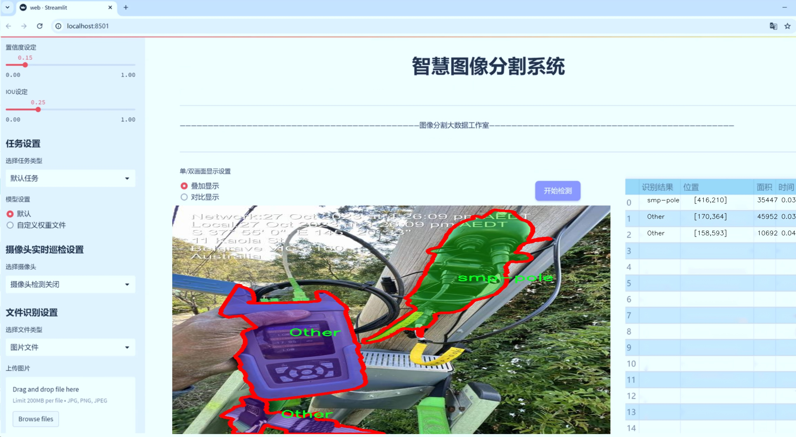
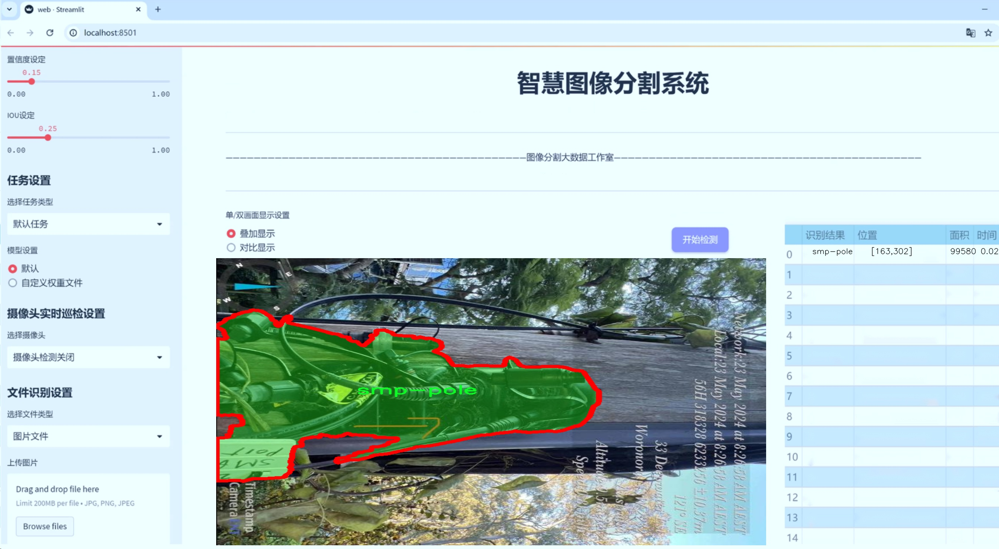
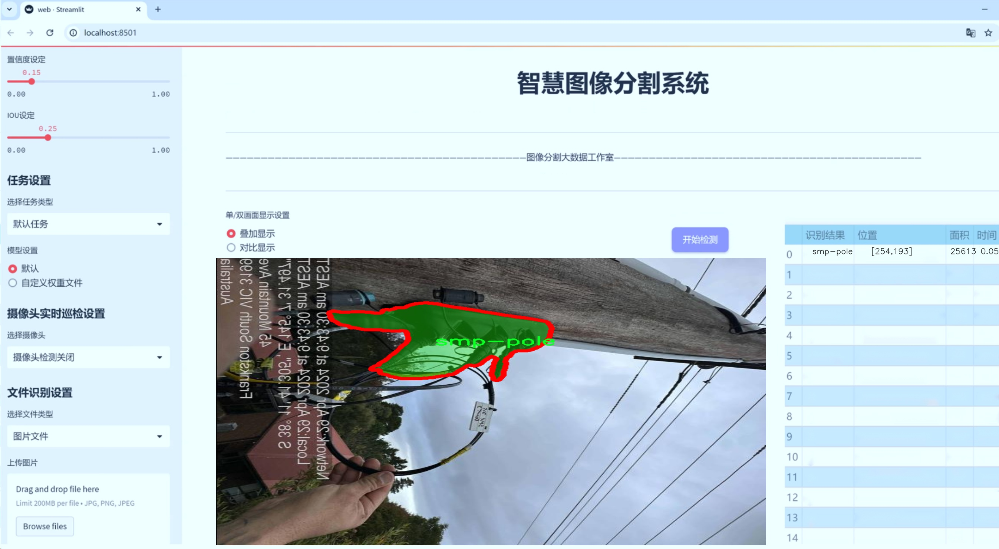
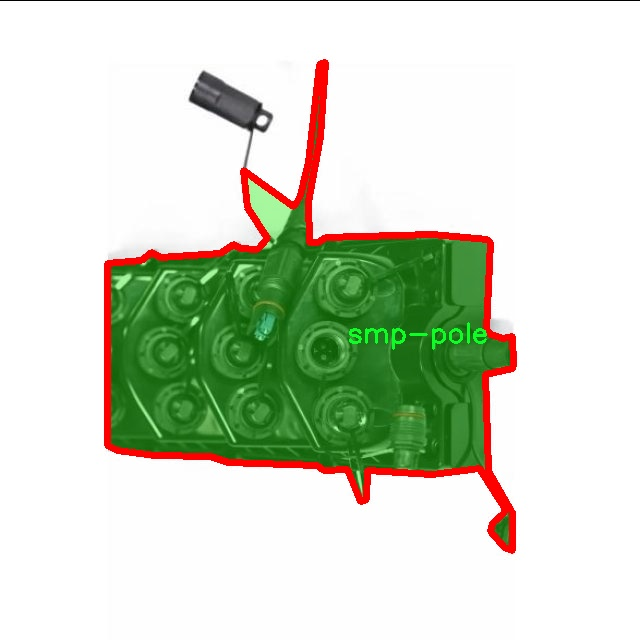
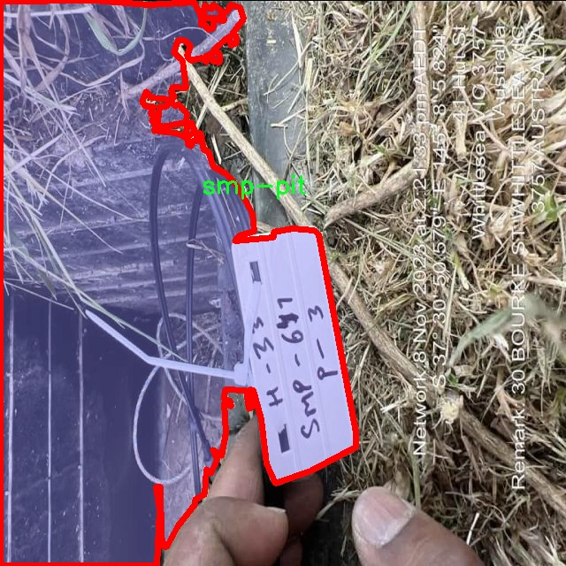
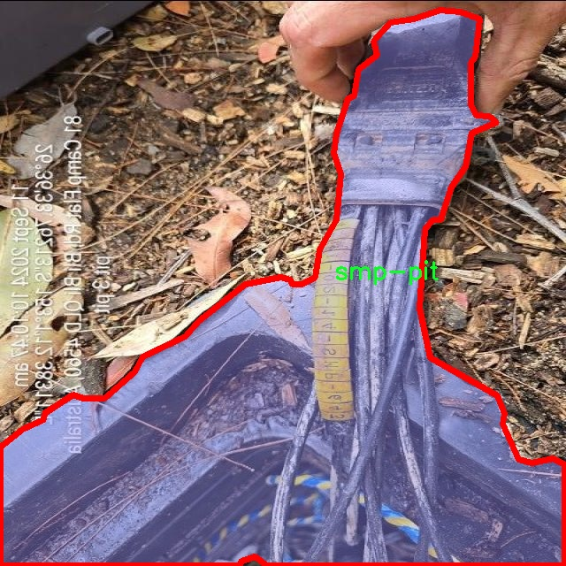
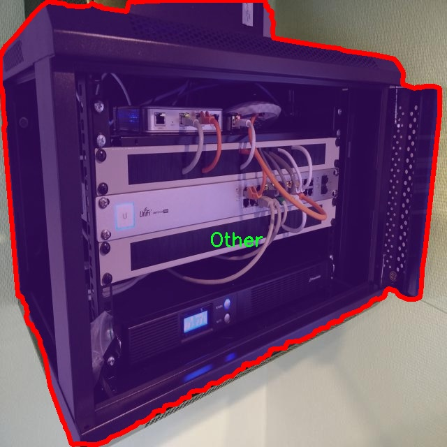
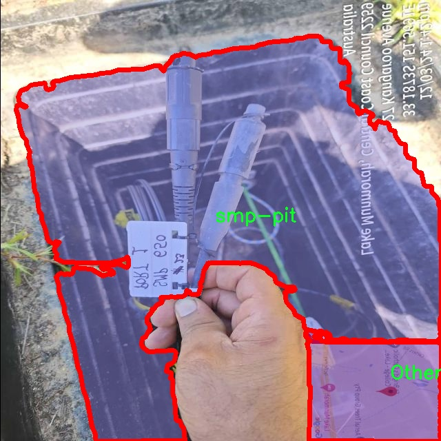

# 电杆基坑分割系统： yolov8-seg-C2f-CloAtt

### 1.研究背景与意义

[参考博客](https://gitee.com/YOLOv8_YOLOv11_Segmentation_Studio/projects)

[博客来源](https://kdocs.cn/l/cszuIiCKVNis)

研究背景与意义

随着城市化进程的加快，基础设施建设的需求日益增加，尤其是电力系统的建设与维护。电杆作为电力传输的重要组成部分，其基坑的合理设计与管理直接影响到电力系统的安全性与稳定性。因此，如何高效、准确地对电杆基坑进行分割与识别，成为了电力工程领域亟待解决的问题。传统的人工检测方法不仅耗时耗力，而且容易受到人为因素的影响，导致检测结果的不准确性。近年来，深度学习技术的迅猛发展为图像处理领域带来了新的机遇，尤其是目标检测与分割任务的性能显著提升。

YOLO（You Only Look Once）系列模型因其高效的实时检测能力而受到广泛关注。YOLOv8作为该系列的最新版本，具备了更强的特征提取能力和更快的推理速度，适用于各种复杂场景下的目标检测与分割任务。然而，针对电杆基坑这一特定应用场景，YOLOv8的标准模型可能无法充分满足需求。因此，基于YOLOv8的改进方案，针对电杆基坑的特征进行优化，具有重要的研究价值。

本研究采用的smp-pole-pit数据集包含1100幅图像，涵盖了三类目标：其他、smp-pit和smp-pole。这一数据集的多样性为模型的训练与验证提供了丰富的样本，能够有效提升模型的泛化能力。通过对这些图像进行实例分割，不仅可以精确识别电杆及其基坑的位置，还能够提取出其形状与尺寸等信息，为后续的工程设计与维护提供数据支持。

改进YOLOv8的电杆基坑分割系统，不仅能够提高电杆基坑的检测精度，还能在实时性方面满足工程现场的需求。通过引入先进的图像处理技术与深度学习算法，研究将推动电力基础设施的智能化管理进程，降低人工成本，提高工作效率。此外，该研究还具有重要的社会意义，能够有效提升电力系统的安全性，减少因电杆基坑问题导致的事故发生，从而保障公众的用电安全。

综上所述，基于改进YOLOv8的电杆基坑分割系统的研究，不仅是对深度学习技术在电力工程领域应用的探索，更是对电力基础设施管理模式的创新尝试。通过这一研究，期望能够为电力行业提供更为高效、准确的解决方案，推动电力系统的智能化与现代化发展。

### 2.图片演示







注意：本项目提供完整的训练源码数据集和训练教程,由于此博客编辑较早,暂不提供权重文件（best.pt）,需要按照6.训练教程进行训练后实现上图效果。

### 3.视频演示

[3.1 视频演示](https://www.bilibili.com/video/BV1irzQY5EV3/)

### 4.数据集信息

##### 4.1 数据集类别数＆类别名

nc: 3
names: ['Other', 'smp-pit', 'smp-pole']


##### 4.2 数据集信息简介

数据集信息展示

在现代计算机视觉领域，数据集的构建与选择对于模型的训练和性能提升至关重要。本次研究所采用的数据集名为“smp-pole-pit”，其主要目标是为改进YOLOv8-seg模型在电杆基坑分割任务中的表现提供强有力的支持。该数据集的设计充分考虑了电杆基坑的特征与实际应用场景，确保其在多样性和代表性方面能够满足深度学习模型的需求。

“smp-pole-pit”数据集包含三个主要类别，分别为“Other”、“smp-pit”和“smp-pole”。这些类别的划分不仅反映了电杆基坑的不同组成部分，也为模型提供了更为细致的学习目标。首先，“Other”类别涵盖了与电杆基坑相关但不属于特定类别的对象或背景信息，这一类别的存在有助于模型在处理复杂场景时，能够更好地进行背景抑制与目标分离。其次，“smp-pit”类别专注于电杆基坑的具体区域，标注了电杆基坑的边界与特征，使得模型能够准确识别并分割出这一重要部分。最后，“smp-pole”类别则专注于电杆本身，标注了电杆的形状、位置及其与基坑的关系，确保模型能够在分割过程中有效地识别电杆的存在与特征。

数据集的构建过程经过了严格的标注与验证，确保每个类别的样本数量充足且标注准确。为了提高模型的泛化能力，数据集中的样本来源于多种不同的环境与条件，包括城市、乡村及不同的天气状况。这种多样性使得模型在实际应用中能够更好地适应不同的场景，提升其鲁棒性与准确性。此外，数据集还包含了多种不同角度与距离的图像，使得模型能够学习到电杆基坑在不同视角下的特征表现。

在数据集的使用过程中，研究者们将通过数据增强技术进一步丰富样本的多样性。这些技术包括旋转、缩放、翻转以及颜色变换等，旨在提高模型的学习能力和对未知数据的适应性。通过这些手段，研究者希望能够有效提升YOLOv8-seg模型在电杆基坑分割任务中的性能，使其在实际应用中能够更准确地进行目标检测与分割。

综上所述，“smp-pole-pit”数据集为改进YOLOv8-seg模型提供了坚实的基础，其多样的类别设置与丰富的样本来源为模型的训练提供了良好的数据支持。随着研究的深入，期待该数据集能够为电杆基坑分割技术的发展做出贡献，并推动相关领域的进步与应用。











### 5.项目依赖环境部署教程（零基础手把手教学）

[5.1 环境部署教程链接（零基础手把手教学）](https://www.bilibili.com/video/BV1jG4Ve4E9t/?vd_source=bc9aec86d164b67a7004b996143742dc)


[5.2 安装Python虚拟环境创建和依赖库安装视频教程链接（零基础手把手教学）](https://www.bilibili.com/video/BV1nA4VeYEze/?vd_source=bc9aec86d164b67a7004b996143742dc)

### 6.手把手YOLOV8-seg训练视频教程（零基础手把手教学）

[6.1 手把手YOLOV8-seg训练视频教程（零基础小白有手就能学会）](https://www.bilibili.com/video/BV1cA4VeYETe/?vd_source=bc9aec86d164b67a7004b996143742dc)


按照上面的训练视频教程链接加载项目提供的数据集，运行train.py即可开始训练



     Epoch   gpu_mem       box       obj       cls    labels  img_size
     1/200     0G   0.01576   0.01955  0.007536        22      1280: 100%|██████████| 849/849 [14:42<00:00,  1.04s/it]
               Class     Images     Labels          P          R     mAP@.5 mAP@.5:.95: 100%|██████████| 213/213 [01:14<00:00,  2.87it/s]
                 all       3395      17314      0.994      0.957      0.0957      0.0843

     Epoch   gpu_mem       box       obj       cls    labels  img_size
     2/200     0G   0.01578   0.01923  0.007006        22      1280: 100%|██████████| 849/849 [14:44<00:00,  1.04s/it]
               Class     Images     Labels          P          R     mAP@.5 mAP@.5:.95: 100%|██████████| 213/213 [01:12<00:00,  2.95it/s]
                 all       3395      17314      0.996      0.956      0.0957      0.0845

     Epoch   gpu_mem       box       obj       cls    labels  img_size
     3/200     0G   0.01561    0.0191  0.006895        27      1280: 100%|██████████| 849/849 [10:56<00:00,  1.29it/s]
               Class     Images     Labels          P          R     mAP@.5 mAP@.5:.95: 100%|███████   | 187/213 [00:52<00:00,  4.04it/s]
                 all       3395      17314      0.996      0.957      0.0957      0.0845


### 7.50+种全套YOLOV8-seg创新点加载调参实验视频教程（一键加载写好的改进模型的配置文件）

[7.1 50+种全套YOLOV8-seg创新点加载调参实验视频教程（一键加载写好的改进模型的配置文件）](https://www.bilibili.com/video/BV1Hw4VePEXv/?vd_source=bc9aec86d164b67a7004b996143742dc)

### YOLOV8-seg算法简介

原始YOLOv8-seg算法原理

YOLOv8-seg算法是YOLO系列的最新发展，继承了YOLOv3和YOLOv5的优良传统，并在此基础上进行了多项创新与改进。该算法不仅在目标检测方面表现出色，还在图像分割任务中展现了其强大的能力。YOLOv8-seg通过高效的网络结构和优化的损失函数，提升了目标检测和分割的精度与速度，适应了多种应用场景的需求。

首先，YOLOv8-seg算法的网络结构由四个主要部分组成：输入端、骨干网络、颈部网络和头部网络。输入端负责数据的预处理，包括马赛克增强、混合增强、空间扰动和颜色扰动等，这些数据增强技术能够有效提高模型的鲁棒性和泛化能力。马赛克增强通过将多张图像拼接在一起，增加了训练样本的多样性；而混合增强则通过将不同图像进行融合，进一步丰富了数据集的特征分布。

在骨干网络部分，YOLOv8-seg采用了新的C2f模块，取代了YOLOv5中的C3模块。C2f模块引入了ELAN结构，通过更多的分支和跨层连接，增强了梯度流动，提升了特征表示能力。这种设计使得网络在深层次特征学习时，能够更好地捕捉到细节信息，从而提高了目标检测和分割的精度。C2f模块的设计理念是通过引入多个shortcut连接，缓解深层网络中的梯度消失问题，确保信息在网络中的有效传递。

颈部网络采用了路径聚合网络（PAN）结构，与特征金字塔网络（FPN）相结合，进一步增强了多尺度特征的融合能力。PAN结构通过自下而上的特征融合，将不同层次的特征进行有效整合，使得模型在处理不同尺度的目标时，能够更好地捕捉到目标的语义信息和细节信息。这种特征融合策略在目标检测和分割任务中尤为重要，因为不同尺度的目标在图像中的表现各异，只有通过有效的特征融合，才能提高模型的整体性能。

头部网络是YOLOv8-seg的关键部分，它将分类和检测过程进行了有效的解耦。与以往的耦合头结构不同，YOLOv8-seg采用了解耦头结构，分别处理分类和回归任务。这种设计不仅提高了模型的灵活性，还加速了目标检测和分割的过程。解耦头结构通过两条并行的分支，分别提取类别特征和位置特征，最后通过1×1卷积层进行分类和定位的任务。这样的设计使得模型在进行目标检测时，能够更加专注于每个任务的特征提取，提升了整体的检测精度。

在损失函数的设计上，YOLOv8-seg采用了多种先进的损失计算策略，以提高模型的训练效果。分类损失采用了变焦损失（Varifocal Loss），而回归损失则结合了分布焦点损失（Distribution Focal Loss）和完全交并比损失（Complete Intersection over Union Loss）。这种损失函数的组合，能够有效解决样本不平衡问题，尤其是在目标检测和分割任务中，正负样本的比例往往不均衡，使用合适的损失函数能够显著提升模型的学习效果。

YOLOv8-seg在标签分配策略上也进行了创新，采用了动态标签分配策略，以提高正负样本的匹配效率。通过Task-Aligned Assigner策略，YOLOv8-seg能够根据分类与回归的分数加权结果，动态选择正样本。这种策略不仅提高了样本的利用率，还有效减少了训练过程中的噪声，进一步提升了模型的性能。

总的来说，YOLOv8-seg算法通过引入新的网络结构、优化的损失函数和动态的标签分配策略，显著提升了目标检测和分割的精度与速度。其在多种应用场景中的优异表现，展示了YOLO系列算法在计算机视觉领域的强大潜力。随着YOLOv8-seg的不断发展与完善，未来在目标检测和图像分割等任务中，必将发挥更大的作用。


### 9.系统功能展示（检测对象为举例，实际内容以本项目数据集为准）

图9.1.系统支持检测结果表格显示

  图9.2.系统支持置信度和IOU阈值手动调节

  图9.3.系统支持自定义加载权重文件best.pt(需要你通过步骤5中训练获得)

  图9.4.系统支持摄像头实时识别

  图9.5.系统支持图片识别

  图9.6.系统支持视频识别

  图9.7.系统支持识别结果文件自动保存

  图9.8.系统支持Excel导出检测结果数据


### 10.50+种全套YOLOV8-seg创新点原理讲解（非科班也可以轻松写刊发刊，V11版本正在科研待更新）

#### 10.1 由于篇幅限制，每个创新点的具体原理讲解就不一一展开，具体见下列网址中的创新点对应子项目的技术原理博客网址【Blog】：


[10.1 50+种全套YOLOV8-seg创新点原理讲解链接](https://gitee.com/qunmasj/good)

#### 10.2 部分改进模块原理讲解(完整的改进原理见上图和技术博客链接)【如果此小节的图加载失败可以通过CSDN或者Github搜索该博客的标题访问原始博客，原始博客图片显示正常】
### FasterNet简介
神经网络在图像分类、检测和分割等各种计算机视觉任务中经历了快速发展。尽管其令人印象深刻的性能为许多应用程序提供了动力，但一个巨大的趋势是追求具有低延迟和高吞吐量的快速神经网络，以获得良好的用户体验、即时响应和安全原因等。

如何快速？研究人员和从业者不需要更昂贵的计算设备，而是倾向于设计具有成本效益的快速神经网络，降低计算复杂度，主要以浮点运算（FLOPs）的数量来衡量。

MobileNet、ShuffleNet和GhostNet等利用深度卷积（DWConv）和/或组卷积（GConv）来提取空间特征。然而，在减少FLOPs的过程中，算子经常会受到内存访问增加的副作用的影响。MicroNet进一步分解和稀疏网络，将其FLOPs推至极低水平。尽管这种方法在FLOPs方面有所改进，但其碎片计算效率很低。此外，上述网络通常伴随着额外的数据操作，如级联、Shuffle和池化，这些操作的运行时间对于小型模型来说往往很重要。

除了上述纯卷积神经网络（CNNs）之外，人们对使视觉Transformer（ViTs）和多层感知器（MLP）架构更小更快也越来越感兴趣。例如，MobileViT和MobileFormer通过将DWConv与改进的注意力机制相结合，降低了计算复杂性。然而，它们仍然受到DWConv的上述问题的困扰，并且还需要修改的注意力机制的专用硬件支持。使用先进但耗时的标准化和激活层也可能限制其在设备上的速度。

所有这些问题一起导致了以下问题：这些“快速”的神经网络真的很快吗？为了回答这个问题，作者检查了延迟和FLOPs之间的关系，这由


其中FLOPS是每秒浮点运算的缩写，作为有效计算速度的度量。虽然有许多减少FLOPs的尝试，但都很少考虑同时优化FLOPs以实现真正的低延迟。为了更好地理解这种情况，作者比较了Intel CPU上典型神经网络的FLOPS。


图中的结果表明，许多现有神经网络的FLOPS较低，其FLOPS通常低于流行的ResNet50。由于FLOPS如此之低，这些“快速”的神经网络实际上不够快。它们的FLOPs减少不能转化为延迟的确切减少量。在某些情况下，没有任何改善，甚至会导致更糟的延迟。例如，CycleMLP-B1具有ResNet50的一半FLOPs，但运行速度较慢（即CycleMLPB1与ResNet50:111.9ms与69.4ms）。

请注意，FLOPs与延迟之间的差异在之前的工作中也已被注意到，但由于它们采用了DWConv/GConv和具有低FLOPs的各种数据处理，因此部分问题仍未解决。人们认为没有更好的选择。

该博客提供的方案通过开发一种简单、快速、有效的运算符来消除这种差异，该运算符可以在减少FLOPs的情况下保持高FLOPS。

具体来说，作者重新审视了现有的操作符，特别是DWConv的计算速度——FLOPS。作者发现导致低FLOPS问题的主要原因是频繁的内存访问。然后，作者提出了PConv作为一种竞争性替代方案，它减少了计算冗余以及内存访问的数量。

图1说明了PConv的设计。它利用了特征图中的冗余，并系统地仅在一部分输入通道上应用规则卷积（Conv），而不影响其余通道。本质上，PConv的FLOPs低于常规Conv，而FLOPs高于DWConv/GConv。换句话说，PConv更好地利用了设备上的计算能力。PConv在提取空间特征方面也很有效，这在本文后面的实验中得到了验证。

作者进一步引入PConv设计了FasterNet作为一个在各种设备上运行速度非常快的新网络家族。特别是，FasterNet在分类、检测和分割任务方面实现了最先进的性能，同时具有更低的延迟和更高的吞吐量。例如，在GPU、CPU和ARM处理器上，小模型FasterNet-T0分别比MobileVitXXS快3.1倍、3.1倍和2.5倍，而在ImageNet-1k上的准确率高2.9%。大模型FasterNet-L实现了83.5%的Top-1精度，与Swin-B不相上下，同时在GPU上提供了49%的高吞吐量，在CPU上节省了42%的计算时间。

总之，贡献如下：

指出了实现更高FLOPS的重要性，而不仅仅是为了更快的神经网络而减少FLOPs。

引入了一种简单但快速且有效的卷积PConv，它很有可能取代现有的选择DWConv。

推出FasterNet，它在GPU、CPU和ARM处理器等多种设备上运行良好且普遍快速。

对各种任务进行了广泛的实验，并验证了PConv和FasterNet的高速性和有效性。

### Conv和FasterNet的设计
#### 原理

DWConv是Conv的一种流行变体，已被广泛用作许多神经网络的关键构建块。对于输入，DWConv应用个滤波器来计算输出。如图（b）所示，每个滤波器在一个输入通道上进行空间滑动，并对一个输出通道做出贡献。

与具有的FLOPs常规Conv相比，这种深度计算使得DWConv仅仅具有的FLOPs。虽然在减少FLOPs方面有效，但DWConv（通常后跟逐点卷积或PWConv）不能简单地用于替换常规Conv，因为它会导致严重的精度下降。因此，在实践中，DWConv的通道数（或网络宽度）增加到＞以补偿精度下降，例如，倒置残差块中的DWConv宽度扩展了6倍。然而，这会导致更高的内存访问，这会造成不可忽略的延迟，并降低总体计算速度，尤其是对于I/O绑定设备。特别是，内存访问的数量现在上升到


它比一个常规的Conv的值要高，即，


注意，内存访问花费在I/O操作上，这被认为已经是最小的成本，很难进一步优化。

#### PConv作为一个基本的算子


在下面演示了通过利用特征图的冗余度可以进一步优化成本。如图所示，特征图在不同通道之间具有高度相似性。许多其他著作也涵盖了这种冗余，但很少有人以简单而有效的方式充分利用它。


具体而言，作者提出了一种简单的PConv，以同时减少计算冗余和内存访问。图4中的左下角说明了PConv的工作原理。它只需在输入通道的一部分上应用常规Conv进行空间特征提取，并保持其余通道不变。对于连续或规则的内存访问，将第一个或最后一个连续的通道视为整个特征图的代表进行计算。在不丧失一般性的情况下认为输入和输出特征图具有相同数量的通道。因此，PConv的FLOPs仅


对于典型的r＝1/4 ，PConv的FLOPs只有常规Conv的1/16。此外，PConv的内存访问量较小，即：


对于r＝1/4，其仅为常规Conv的1/4。

由于只有通道用于空间特征提取，人们可能会问是否可以简单地移除剩余的（c−）通道？如果是这样，PConv将退化为具有较少通道的常规Conv，这偏离了减少冗余的目标。

请注意，保持其余通道不变，而不是从特征图中删除它们。这是因为它们对后续PWConv层有用，PWConv允许特征信息流经所有通道。

#### PConv之后是PWConv


为了充分有效地利用来自所有通道的信息，进一步将逐点卷积（PWConv）附加到PConv。它们在输入特征图上的有效感受野看起来像一个T形Conv，与均匀处理补丁的常规Conv相比，它更专注于中心位置，如图5所示。为了证明这个T形感受野的合理性，首先通过计算位置的Frobenius范数来评估每个位置的重要性。


假设，如果一个职位比其他职位具有更大的Frobenius范数，则该职位往往更重要。对于正则Conv滤波器，位置处的Frobenius范数由计算，其中。


一个显著位置是具有最大Frobenius范数的位置。然后，在预训练的ResNet18中集体检查每个过滤器，找出它们的显著位置，并绘制显著位置的直方图。图6中的结果表明，中心位置是过滤器中最常见的突出位置。换句话说，中心位置的权重比周围的更重。这与集中于中心位置的T形计算一致。

虽然T形卷积可以直接用于高效计算，但作者表明，将T形卷积分解为PConv和PWConv更好，因为该分解利用了滤波器间冗余并进一步节省了FLOPs。对于相同的输入和输出，T形Conv的FLOPs可以计算为:


它高于PConv和PWConv的流量，即：


其中和（例如，当时）。此外，可以很容易地利用常规Conv进行两步实现。

# FasterNet作为Backbone
鉴于新型PConv和现成的PWConv作为主要的算子，进一步提出FasterNet，这是一个新的神经网络家族，运行速度非常快，对许多视觉任务非常有效。目标是使体系结构尽可能简单，使其总体上对硬件友好。


在图中展示了整体架构。它有4个层次级，每个层次级前面都有一个嵌入层（步长为4的常规4×4卷积）或一个合并层（步长为2的常规2×2卷积），用于空间下采样和通道数量扩展。每个阶段都有一堆FasterNet块。作者观察到，最后两个阶段中的块消耗更少的内存访问，并且倾向于具有更高的FLOPS，如表1中的经验验证。因此，放置了更多FasterNet块，并相应地将更多计算分配给最后两个阶段。每个FasterNet块有一个PConv层，后跟2个PWConv（或Conv 1×1）层。它们一起显示为倒置残差块，其中中间层具有扩展的通道数量，并且放置了Shorcut以重用输入特征。

除了上述算子，标准化和激活层对于高性能神经网络也是不可或缺的。然而，许多先前的工作在整个网络中过度使用这些层，这可能会限制特征多样性，从而损害性能。它还可以降低整体计算速度。相比之下，只将它们放在每个中间PWConv之后，以保持特征多样性并实现较低的延迟。

此外，使用批次归一化（BN）代替其他替代方法。BN的优点是，它可以合并到其相邻的Conv层中，以便更快地进行推断，同时与其他层一样有效。对于激活层，根据经验选择了GELU用于较小的FasterNet变体，而ReLU用于较大的FasterNet变体，同时考虑了运行时间和有效性。最后三个层，即全局平均池化、卷积1×1和全连接层，一起用于特征转换和分类。

为了在不同的计算预算下提供广泛的应用，提供FasterNet的Tiny模型、Small模型、Medium模型和Big模型变体，分别称为FasterNetT0/1/2、FasterNet-S、FasterNet-M和FasterNet-L。它们具有相似的结构，但深度和宽度不同。

架构规范如下：


### 11.项目核心源码讲解（再也不用担心看不懂代码逻辑）

#### 11.1 ultralytics\nn\extra_modules\ops_dcnv3\test.py

以下是经过精简和注释的核心代码部分，主要包括前向和反向检查函数，以及时间成本检查函数。注释详细解释了每个部分的功能和作用。

```python
# --------------------------------------------------------
# InternImage
# Copyright (c) 2022 OpenGVLab
# Licensed under The MIT License [see LICENSE for details]
# --------------------------------------------------------

import time
import torch
from functions.dcnv3_func import DCNv3Function, dcnv3_core_pytorch

# 输入和输出的尺寸参数
H_in, W_in = 8, 8  # 输入图像的高度和宽度
N, M, D = 2, 4, 16  # 批量大小、输出通道数和输入通道数
Kh, Kw = 3, 3  # 卷积核的高度和宽度
pad = 1  # 填充
dilation = 1  # 膨胀
stride = 1  # 步幅

# 计算输出尺寸
H_out = (H_in + 2 * pad - (dilation * (Kh - 1) + 1)) // stride + 1
W_out = (W_in + 2 * pad - (dilation * (Kw - 1) + 1)) // stride + 1

torch.manual_seed(3)  # 设置随机种子以确保可重复性

@torch.no_grad()
def check_forward_equal_with_pytorch():
    """
    检查自定义DCNv3实现与PyTorch实现的前向传播结果是否相等
    """
    # 随机生成输入、偏移量和掩码
    input = torch.rand(N, H_in, W_in, M * D).cuda() * 0.01
    offset = torch.rand(N, H_out, W_out, M * 2).cuda() * 10
    mask = torch.rand(N, H_out, W_out, M, Kh * Kw).cuda() + 1e-5
    mask /= mask.sum(-1, keepdim=True)  # 归一化掩码
    mask = mask.reshape(N, H_out, W_out, M * Kh * Kw)

    # 使用PyTorch的实现进行前向传播
    output_pytorch = dcnv3_core_pytorch(
        input,
        offset,
        mask,
        Kh, Kw, stride, stride, Kh // 2, Kw // 2, dilation, dilation, M, D, 1.0, False
    ).detach().cpu()

    # 使用自定义的DCNv3实现进行前向传播
    output_cuda = DCNv3Function.apply(
        input,
        offset,
        mask,
        Kh, Kw, stride, stride, Kh // 2, Kw // 2, dilation, dilation, M, D, 1.0, 2, False
    ).detach().cpu()

    # 检查两个输出是否相近
    fwdok = torch.allclose(output_cuda, output_pytorch, rtol=1e-2, atol=1e-3)
    max_abs_err = (output_cuda - output_pytorch).abs().max()
    max_rel_err = ((output_cuda - output_pytorch).abs() / output_pytorch.abs()).max()
    print(f'>>> forward check: {fwdok}, max_abs_err: {max_abs_err:.2e}, max_rel_err: {max_rel_err:.2e}')


@torch.no_grad()
def check_time_cost(im2col_step=128):
    """
    检查DCNv3前向传播的时间成本
    """
    N = 512  # 批量大小
    H_in, W_in = 64, 64  # 输入图像的高度和宽度
    H_out = (H_in + 2 * pad - (dilation * (Kh - 1) + 1)) // stride + 1
    W_out = (W_in + 2 * pad - (dilation * (Kw - 1) + 1)) // stride + 1

    # 随机生成输入、偏移量和掩码
    input = torch.rand(N, H_in, W_in, M * D).cuda() * 0.01
    offset = torch.rand(N, H_out, W_out, M * 2).cuda() * 10
    mask = torch.rand(N, H_out, W_out, M, Kh * Kw).cuda() + 1e-5
    mask /= mask.sum(-1, keepdim=True)
    mask = mask.reshape(N, H_out, W_out, M * Kh * Kw)

    print(f'>>> time cost: im2col_step {im2col_step}; input {input.shape}; points {Kh * Kw}')
    repeat = 100  # 重复次数
    for _ in range(repeat):
        output_cuda = DCNv3Function.apply(
            input,
            offset,
            mask,
            Kh, Kw, stride, stride, Kh // 2, Kw // 2, dilation, dilation, M, D, 1.0,
            im2col_step, False
        )
    torch.cuda.synchronize()  # 确保CUDA操作完成
    start = time.time()  # 记录开始时间
    for _ in range(repeat):
        output_cuda = DCNv3Function.apply(
            input,
            offset,
            mask,
            Kh, Kw, stride, stride, Kh // 2, Kw // 2, dilation, dilation, M, D, 1.0,
            im2col_step, False
        )
    torch.cuda.synchronize()  # 确保CUDA操作完成
    print(f'forward time cost: {(time.time() - start) / repeat:.6f} seconds')


if __name__ == '__main__':
    check_forward_equal_with_pytorch()  # 检查前向传播
    for i in range(3):
        im2col_step = 128 * (2 ** i)  # 不同的im2col步长
        check_time_cost(im2col_step)  # 检查时间成本
```

### 代码核心部分说明：
1. **输入和输出参数设置**：定义了输入图像的尺寸、批量大小、通道数等参数。
2. **前向传播检查**：`check_forward_equal_with_pytorch`函数用于比较自定义实现与PyTorch内置实现的输出是否一致。
3. **时间成本检查**：`check_time_cost`函数用于测量DCNv3前向传播的执行时间，以评估性能。
4. **主函数**：在主函数中调用前向传播检查和时间成本检查函数。

通过以上代码和注释，读者可以理解DCNv3的前向传播实现及其性能评估的基本流程。

这个文件是一个用于测试DCNv3（Deformable Convolutional Networks v3）功能的Python脚本，主要依赖于PyTorch库。代码的主要目的是验证DCNv3的前向和反向传播是否与PyTorch的实现相符，并测量其性能。

首先，文件中导入了一些必要的库，包括PyTorch和一些数学函数。接着，定义了一些常量，如输入和输出的高度和宽度、通道数、卷积核的大小等。这些常量用于后续的张量创建和计算。

接下来，定义了几个测试函数。`check_forward_equal_with_pytorch_double`和`check_forward_equal_with_pytorch_float`用于检查DCNv3的前向传播结果是否与PyTorch的实现一致。它们生成随机输入、偏移量和掩码，然后调用自定义的DCNv3函数和PyTorch的核心函数，比较它们的输出。函数还计算了最大绝对误差和相对误差，并打印出结果。

类似地，`check_backward_equal_with_pytorch_double`和`check_backward_equal_with_pytorch_float`用于验证反向传播的梯度是否一致。它们生成随机输入并计算梯度，然后比较DCNv3实现和PyTorch实现的梯度。

最后，`check_time_cost`函数用于测量DCNv3在特定输入大小下的前向传播时间。它通过多次调用DCNv3函数来计算平均时间，并输出结果。

在主程序中，依次调用这些测试函数，以验证DCNv3的实现是否正确，并测试其性能。通过这些测试，开发者可以确保DCNv3在不同条件下的稳定性和效率。

#### 11.2 ultralytics\nn\backbone\convnextv2.py

以下是经过简化和注释的核心代码部分：

```python
import torch
import torch.nn as nn
import torch.nn.functional as F

class LayerNorm(nn.Module):
    """ 自定义的层归一化，支持两种数据格式：channels_last 和 channels_first """
    def __init__(self, normalized_shape, eps=1e-6, data_format="channels_last"):
        super().__init__()
        # 权重和偏置初始化
        self.weight = nn.Parameter(torch.ones(normalized_shape))
        self.bias = nn.Parameter(torch.zeros(normalized_shape))
        self.eps = eps
        self.data_format = data_format
        if self.data_format not in ["channels_last", "channels_first"]:
            raise NotImplementedError 
        self.normalized_shape = (normalized_shape, )
    
    def forward(self, x):
        # 根据数据格式选择不同的归一化方式
        if self.data_format == "channels_last":
            return F.layer_norm(x, self.normalized_shape, self.weight, self.bias, self.eps)
        elif self.data_format == "channels_first":
            u = x.mean(1, keepdim=True)  # 计算均值
            s = (x - u).pow(2).mean(1, keepdim=True)  # 计算方差
            x = (x - u) / torch.sqrt(s + self.eps)  # 标准化
            x = self.weight[:, None, None] * x + self.bias[:, None, None]  # 应用权重和偏置
            return x

class Block(nn.Module):
    """ ConvNeXtV2的基本模块 """
    def __init__(self, dim, drop_path=0.):
        super().__init__()
        # 深度可分离卷积
        self.dwconv = nn.Conv2d(dim, dim, kernel_size=7, padding=3, groups=dim)
        self.norm = LayerNorm(dim, eps=1e-6)
        self.pwconv1 = nn.Linear(dim, 4 * dim)  # 1x1卷积
        self.act = nn.GELU()  # 激活函数
        self.pwconv2 = nn.Linear(4 * dim, dim)  # 1x1卷积
        self.drop_path = nn.Identity() if drop_path <= 0. else DropPath(drop_path)  # 随机深度

    def forward(self, x):
        input = x
        x = self.dwconv(x)  # 深度卷积
        x = x.permute(0, 2, 3, 1)  # 转换维度
        x = self.norm(x)  # 归一化
        x = self.pwconv1(x)  # 1x1卷积
        x = self.act(x)  # 激活
        x = self.pwconv2(x)  # 1x1卷积
        x = x.permute(0, 3, 1, 2)  # 恢复维度

        x = input + self.drop_path(x)  # 残差连接
        return x

class ConvNeXtV2(nn.Module):
    """ ConvNeXt V2模型 """
    def __init__(self, in_chans=3, num_classes=1000, depths=[3, 3, 9, 3], dims=[96, 192, 384, 768], drop_path_rate=0.):
        super().__init__()
        self.downsample_layers = nn.ModuleList()  # 下采样层
        # 构建下采样层
        stem = nn.Sequential(
            nn.Conv2d(in_chans, dims[0], kernel_size=4, stride=4),
            LayerNorm(dims[0], eps=1e-6, data_format="channels_first")
        )
        self.downsample_layers.append(stem)
        for i in range(3):
            downsample_layer = nn.Sequential(
                LayerNorm(dims[i], eps=1e-6, data_format="channels_first"),
                nn.Conv2d(dims[i], dims[i+1], kernel_size=2, stride=2),
            )
            self.downsample_layers.append(downsample_layer)

        self.stages = nn.ModuleList()  # 特征提取阶段
        for i in range(4):
            stage = nn.Sequential(
                *[Block(dim=dims[i]) for _ in range(depths[i])]
            )
            self.stages.append(stage)

        self.norm = nn.LayerNorm(dims[-1], eps=1e-6)  # 最后的归一化层
        self.head = nn.Linear(dims[-1], num_classes)  # 分类头

    def forward(self, x):
        """ 前向传播 """
        for i in range(4):
            x = self.downsample_layers[i](x)  # 下采样
            x = self.stages[i](x)  # 特征提取
        return x

# 示例函数，用于创建不同规模的ConvNeXtV2模型
def convnextv2_tiny(weights='', **kwargs):
    model = ConvNeXtV2(depths=[3, 3, 9, 3], dims=[96, 192, 384, 768], **kwargs)
    if weights:
        model.load_state_dict(torch.load(weights)['model'])
    return model
```

### 代码说明：
1. **LayerNorm**：自定义的层归一化类，支持不同的输入格式，提供了灵活的归一化方式。
2. **Block**：ConvNeXtV2的基本构建块，包含深度卷积、归一化、激活函数和残差连接。
3. **ConvNeXtV2**：整个模型的定义，包含下采样层和多个特征提取阶段。
4. **convnextv2_tiny**：创建特定规模的ConvNeXtV2模型的示例函数，可以加载预训练权重。

这个程序文件实现了一个名为 ConvNeXt V2 的深度学习模型，主要用于图像分类任务。文件中包含多个类和函数，构成了模型的各个部分。

首先，文件导入了必要的库，包括 PyTorch 和一些辅助函数。接着，定义了一个名为 `LayerNorm` 的类，这个类实现了层归一化（Layer Normalization），支持两种数据格式：通道优先（channels_first）和通道最后（channels_last）。在 `forward` 方法中，根据输入数据的格式选择相应的归一化方式。

接下来，定义了 `GRN` 类，表示全局响应归一化（Global Response Normalization）层。这个层通过计算输入的 L2 范数来调整输入特征的响应，使得模型对不同特征的响应更加平衡。

然后，定义了 `Block` 类，表示 ConvNeXt V2 的基本构建块。每个块包含一个深度可分离卷积层、层归一化、一个前馈神经网络（由两个线性层构成）以及 GRN 层。`forward` 方法中，输入经过一系列变换后与输入相加，形成残差连接，增强了模型的学习能力。

`ConvNeXtV2` 类是整个模型的核心，包含多个阶段和下采样层。模型的构造包括输入通道数、分类头的类别数、每个阶段的块数、特征维度、随机深度率等参数。模型的下采样层使用卷积和层归一化来逐步降低特征图的分辨率。每个阶段由多个 `Block` 组成，形成了一个深层的特征提取网络。最后，模型通过一个线性层输出分类结果。

此外，文件中还定义了一个 `update_weight` 函数，用于更新模型的权重。这个函数会检查新权重与模型权重的形状是否匹配，并更新模型的状态字典。

最后，文件提供了一系列函数（如 `convnextv2_atto`、`convnextv2_femto` 等），用于创建不同规模的 ConvNeXt V2 模型。这些函数可以选择性地加载预训练权重，方便用户根据需求构建合适的模型。

总体而言，这个文件实现了一个灵活且高效的卷积神经网络架构，适用于各种图像分类任务。

#### 11.3 ultralytics\data\base.py

以下是经过简化和注释的核心代码部分，主要保留了数据集的基本结构和功能：

```python
import glob
import os
import random
from copy import deepcopy
from pathlib import Path
import cv2
import numpy as np
from torch.utils.data import Dataset

class BaseDataset(Dataset):
    """
    基础数据集类，用于加载和处理图像数据。

    参数:
        img_path (str): 图像文件夹的路径。
        imgsz (int, optional): 图像大小，默认为640。
        augment (bool, optional): 是否应用数据增强，默认为True。
        classes (list): 包含的类别列表，默认为None。
        fraction (float): 使用的数据集比例，默认为1.0（使用所有数据）。
    """

    def __init__(self, img_path, imgsz=640, augment=True, classes=None, fraction=1.0):
        """初始化BaseDataset，配置参数和选项。"""
        super().__init__()
        self.img_path = img_path  # 图像路径
        self.imgsz = imgsz  # 图像大小
        self.augment = augment  # 是否进行数据增强
        self.im_files = self.get_img_files(self.img_path)  # 获取图像文件列表
        self.labels = self.get_labels()  # 获取标签
        self.update_labels(include_class=classes)  # 更新标签以包含指定类别
        self.ni = len(self.labels)  # 数据集中图像的数量

    def get_img_files(self, img_path):
        """读取图像文件。"""
        f = []  # 存储图像文件
        for p in img_path if isinstance(img_path, list) else [img_path]:
            p = Path(p)  # 处理路径
            if p.is_dir():  # 如果是目录
                f += glob.glob(str(p / '**' / '*.*'), recursive=True)  # 获取所有图像文件
            elif p.is_file():  # 如果是文件
                with open(p) as t:
                    t = t.read().strip().splitlines()  # 读取文件内容
                    f += [x for x in t]  # 添加到文件列表
            else:
                raise FileNotFoundError(f'{p} 不存在')
        return sorted(f)  # 返回排序后的文件列表

    def update_labels(self, include_class):
        """更新标签，仅包含指定的类别（可选）。"""
        for i in range(len(self.labels)):
            if include_class is not None:
                cls = self.labels[i]['cls']
                # 仅保留指定类别的标签
                self.labels[i]['cls'] = cls[np.isin(cls, include_class)]

    def load_image(self, i):
        """加载数据集中索引为'i'的图像，返回图像及其原始和调整后的尺寸。"""
        im = cv2.imread(self.im_files[i])  # 读取图像
        if im is None:
            raise FileNotFoundError(f'未找到图像 {self.im_files[i]}')
        h0, w0 = im.shape[:2]  # 获取原始高度和宽度
        im = cv2.resize(im, (self.imgsz, self.imgsz))  # 调整图像大小
        return im, (h0, w0), im.shape[:2]  # 返回图像及其尺寸

    def __getitem__(self, index):
        """返回给定索引的图像和标签信息。"""
        label = deepcopy(self.labels[index])  # 深拷贝标签
        label['img'], label['ori_shape'], label['resized_shape'] = self.load_image(index)  # 加载图像
        return label  # 返回标签信息

    def __len__(self):
        """返回数据集中标签的数量。"""
        return len(self.labels)

    def get_labels(self):
        """
        用户可以自定义标签格式，确保输出为字典，包含以下键：
        - im_file: 图像文件路径
        - shape: 图像形状 (高度, 宽度)
        - cls: 类别
        - bboxes: 边界框
        """
        raise NotImplementedError  # 需要用户实现
```

### 代码说明：
1. **BaseDataset类**：这是一个基础数据集类，继承自`torch.utils.data.Dataset`，用于加载和处理图像数据。
2. **初始化方法**：接收图像路径、图像大小、数据增强选项和类别等参数，并初始化相关属性。
3. **get_img_files方法**：根据给定路径获取所有图像文件的路径，支持目录和文件输入。
4. **update_labels方法**：更新标签，只保留指定类别的标签。
5. **load_image方法**：加载指定索引的图像，调整其大小，并返回图像及其原始和调整后的尺寸。
6. **__getitem__方法**：根据索引返回图像和对应的标签信息。
7. **__len__方法**：返回数据集中标签的数量。
8. **get_labels方法**：这是一个抽象方法，用户需要实现以返回标签信息。

这个程序文件定义了一个名为 `BaseDataset` 的类，主要用于加载和处理图像数据，特别是在计算机视觉任务中常用的 YOLO（You Only Look Once）模型的训练过程中。该类继承自 PyTorch 的 `Dataset` 类，提供了一系列功能来处理图像及其标签。

在初始化方法 `__init__` 中，类接收多个参数，包括图像路径、图像大小、是否缓存图像、数据增强的设置、超参数、前缀、批量大小等。根据这些参数，类会加载图像文件并获取相应的标签信息。

`get_img_files` 方法用于读取指定路径下的图像文件。它支持从文件夹中递归查找图像，也可以从文件中读取图像路径。该方法还会检查图像格式是否符合预定义的格式，并根据 `fraction` 参数决定使用数据集的哪一部分。

`update_labels` 方法用于更新标签信息，确保只包含指定的类别，并根据是否使用单类训练来调整标签。

`load_image` 方法负责加载指定索引的图像。如果图像已经缓存，则直接返回；否则，它会尝试从磁盘读取图像并进行必要的调整（如缩放），以适应训练的需求。

`cache_images` 方法则是将图像缓存到内存或磁盘，以提高后续加载的速度。它使用多线程来加速这一过程，并通过 `check_cache_ram` 方法检查系统内存是否足够。

`set_rectangle` 方法用于设置 YOLO 检测的边界框形状为矩形，确保在训练过程中使用的图像具有适当的长宽比。

`__getitem__` 方法是 PyTorch 数据集的标准方法，返回给定索引的图像及其标签信息，并应用预定义的变换。

`__len__` 方法返回数据集中标签的数量，方便在训练时进行批处理。

`build_transforms` 和 `get_labels` 方法是留给用户自定义的接口，用户可以根据自己的需求实现数据增强和标签格式化的逻辑。

总的来说，这个类提供了一个灵活且高效的框架，用于处理图像数据，支持多种数据增强和缓存策略，适用于深度学习模型的训练。

#### 11.4 ultralytics\trackers\basetrack.py

以下是代码中最核心的部分，并附上详细的中文注释：

```python
from collections import OrderedDict
import numpy as np

class TrackState:
    """对象跟踪状态的枚举类。"""
    New = 0      # 新跟踪
    Tracked = 1  # 正在跟踪
    Lost = 2     # 跟踪丢失
    Removed = 3  # 跟踪已移除

class BaseTrack:
    """对象跟踪的基类，处理基本的跟踪属性和操作。"""

    _count = 0  # 全局跟踪ID计数器

    track_id = 0          # 跟踪ID
    is_activated = False   # 跟踪是否已激活
    state = TrackState.New  # 当前跟踪状态

    history = OrderedDict()  # 跟踪历史记录
    features = []            # 特征列表
    curr_feature = None      # 当前特征
    score = 0               # 跟踪得分
    start_frame = 0         # 开始帧
    frame_id = 0            # 当前帧ID
    time_since_update = 0    # 自上次更新以来的时间

    # 多摄像头位置
    location = (np.inf, np.inf)  # 跟踪对象的位置，初始化为无穷大

    @property
    def end_frame(self):
        """返回跟踪的最后帧ID。"""
        return self.frame_id

    @staticmethod
    def next_id():
        """递增并返回全局跟踪ID计数器。"""
        BaseTrack._count += 1
        return BaseTrack._count

    def activate(self, *args):
        """激活跟踪，使用提供的参数。"""
        raise NotImplementedError  # 需要在子类中实现

    def predict(self):
        """预测跟踪的下一个状态。"""
        raise NotImplementedError  # 需要在子类中实现

    def update(self, *args, **kwargs):
        """使用新的观测数据更新跟踪。"""
        raise NotImplementedError  # 需要在子类中实现

    def mark_lost(self):
        """将跟踪标记为丢失。"""
        self.state = TrackState.Lost

    def mark_removed(self):
        """将跟踪标记为已移除。"""
        self.state = TrackState.Removed

    @staticmethod
    def reset_id():
        """重置全局跟踪ID计数器。"""
        BaseTrack._count = 0
```

### 代码核心部分解释：
1. **TrackState 类**：定义了跟踪对象的不同状态，包括新跟踪、正在跟踪、丢失和已移除。

2. **BaseTrack 类**：这是一个对象跟踪的基类，包含了跟踪对象的基本属性和方法。它管理跟踪ID、状态、历史记录、特征等。

3. **属性和方法**：
   - `end_frame`：计算并返回跟踪的最后一帧ID。
   - `next_id`：生成新的跟踪ID，确保每个跟踪对象都有唯一的标识符。
   - `activate`、`predict`、`update`：这些方法是跟踪的核心功能，分别用于激活跟踪、预测下一个状态和更新跟踪信息，但在基类中未实现，需在子类中具体实现。
   - `mark_lost` 和 `mark_removed`：用于更新跟踪状态，标记跟踪对象为丢失或已移除。
   - `reset_id`：重置跟踪ID计数器，通常在重新开始跟踪时使用。

这个程序文件定义了一个用于对象跟踪的基础类 `BaseTrack`，以及一个跟踪状态的枚举类 `TrackState`。首先，`TrackState` 类列出了可能的跟踪状态，包括新建状态（New）、被跟踪状态（Tracked）、丢失状态（Lost）和移除状态（Removed）。这些状态用于描述对象在跟踪过程中的不同阶段。

接下来，`BaseTrack` 类是对象跟踪的基础类，负责处理基本的跟踪属性和操作。该类中定义了一些类属性和实例属性。类属性 `_count` 用于生成唯一的跟踪 ID，`track_id` 是当前跟踪对象的 ID，`is_activated` 表示跟踪是否被激活，`state` 表示当前的跟踪状态，默认为新建状态。`history` 是一个有序字典，用于存储跟踪历史，`features` 列表用于存储特征，`curr_feature` 表示当前特征，`score` 表示跟踪的分数，`start_frame` 和 `frame_id` 分别表示跟踪开始的帧和当前帧，`time_since_update` 表示自上次更新以来的时间。`location` 用于表示多摄像头环境下的位置信息，初始值为无穷大。

`BaseTrack` 类中还定义了一些方法。`end_frame` 属性返回跟踪的最后一帧 ID。`next_id` 静态方法用于递增并返回全局跟踪 ID 计数器。`activate`、`predict` 和 `update` 方法是用于激活跟踪、预测下一个状态和更新跟踪的占位符方法，具体实现需要在子类中定义。`mark_lost` 和 `mark_removed` 方法用于将跟踪状态标记为丢失或移除。最后，`reset_id` 静态方法用于重置全局跟踪 ID 计数器。

总体来说，这个文件为对象跟踪提供了一个基础框架，定义了跟踪对象的基本属性和操作方法，便于后续扩展和实现具体的跟踪算法。

#### 11.5 ultralytics\nn\backbone\repvit.py

以下是经过简化和注释的核心代码部分，主要包含模型的定义和前向传播逻辑。

```python
import torch
import torch.nn as nn
from timm.models.layers import SqueezeExcite

# 定义一个可分离卷积的模块，包含卷积和批归一化
class Conv2d_BN(torch.nn.Sequential):
    def __init__(self, in_channels, out_channels, kernel_size=1, stride=1, padding=0, dilation=1, groups=1):
        super().__init__()
        # 添加卷积层
        self.add_module('conv', torch.nn.Conv2d(in_channels, out_channels, kernel_size, stride, padding, dilation, groups, bias=False))
        # 添加批归一化层
        self.add_module('bn', torch.nn.BatchNorm2d(out_channels))

    @torch.no_grad()
    def fuse_self(self):
        # 融合卷积和批归一化为一个卷积层
        conv, bn = self._modules.values()
        w = bn.weight / (bn.running_var + bn.eps)**0.5  # 归一化权重
        w = conv.weight * w[:, None, None, None]  # 融合权重
        b = bn.bias + (conv.bias - bn.running_mean) * bn.weight / (bn.running_var + bn.eps)**0.5  # 计算偏置
        fused_conv = torch.nn.Conv2d(w.size(1), w.size(0), w.shape[2:], stride=conv.stride, padding=conv.padding, dilation=conv.dilation, groups=conv.groups)
        fused_conv.weight.data.copy_(w)
        fused_conv.bias.data.copy_(b)
        return fused_conv

# 定义残差模块
class Residual(torch.nn.Module):
    def __init__(self, module):
        super().__init__()
        self.module = module

    def forward(self, x):
        return x + self.module(x)  # 残差连接

    @torch.no_grad()
    def fuse_self(self):
        # 融合残差模块
        if isinstance(self.module, Conv2d_BN):
            return self.module.fuse_self()
        return self

# 定义RepViT块
class RepViTBlock(nn.Module):
    def __init__(self, inp, hidden_dim, oup, kernel_size, stride, use_se):
        super(RepViTBlock, self).__init__()
        self.token_mixer = nn.Sequential(
            Conv2d_BN(inp, inp, kernel_size, stride, (kernel_size - 1) // 2, groups=inp),
            SqueezeExcite(inp, 0.25) if use_se else nn.Identity(),
            Conv2d_BN(inp, oup, ks=1, stride=1, pad=0)
        )
        self.channel_mixer = Residual(nn.Sequential(
            Conv2d_BN(oup, hidden_dim, 1, 1, 0),
            nn.GELU(),
            Conv2d_BN(hidden_dim, oup, 1, 1, 0)
        ))

    def forward(self, x):
        return self.channel_mixer(self.token_mixer(x))  # 前向传播

# 定义RepViT模型
class RepViT(nn.Module):
    def __init__(self, cfgs):
        super(RepViT, self).__init__()
        self.features = nn.ModuleList()
        input_channel = cfgs[0][2]  # 获取输入通道数
        for k, t, c, use_se, s in cfgs:
            self.features.append(RepViTBlock(input_channel, input_channel * t, c, k, s, use_se))
            input_channel = c  # 更新输入通道数

    def forward(self, x):
        for f in self.features:
            x = f(x)  # 逐层前向传播
        return x

# 示例：构建RepViT模型并进行前向传播
if __name__ == '__main__':
    cfgs = [
        [3, 2, 64, 1, 1],  # k, t, c, SE, s
        [3, 2, 128, 1, 2],
        [3, 2, 256, 1, 2]
    ]
    model = RepViT(cfgs)  # 创建模型
    inputs = torch.randn((1, 3, 640, 640))  # 创建输入
    res = model(inputs)  # 前向传播
    print(res.size())  # 输出结果的尺寸
```

### 代码说明：
1. **Conv2d_BN**：定义了一个包含卷积和批归一化的模块，并提供了融合这两个层的方法。
2. **Residual**：实现了残差连接的模块，允许输入直接加到输出上。
3. **RepViTBlock**：定义了RepViT的基本构建块，包含了token混合和channel混合的逻辑。
4. **RepViT**：构建整个RepViT模型，包含多个RepViTBlock。
5. **前向传播**：在`__main__`部分，展示了如何实例化模型并进行前向传播。

这个程序文件定义了一个名为 `RepViT` 的深度学习模型，主要用于图像处理任务。该模型基于一种新的网络架构，结合了卷积神经网络（CNN）和视觉变换器（ViT）的特性。文件中包含了多个类和函数，具体功能如下：

首先，文件导入了必要的库，包括 PyTorch 和 NumPy，以及 `timm` 库中的 `SqueezeExcite` 层。接着，定义了一个名为 `replace_batchnorm` 的函数，用于替换网络中的 BatchNorm 层，以便在推理时进行模型融合，从而提高推理速度。

接下来，定义了一个 `_make_divisible` 函数，确保网络中所有层的通道数都是 8 的倍数，这对于某些模型的性能优化是必要的。

`Conv2d_BN` 类是一个自定义的卷积层，包含卷积操作和 BatchNorm 层，并且提供了一个 `fuse_self` 方法，用于将卷积和 BatchNorm 融合为一个操作，从而提高推理效率。

`Residual` 类实现了残差连接，允许在训练时随机丢弃一些输出，以增强模型的鲁棒性。它同样提供了 `fuse_self` 方法，用于融合操作。

`RepVGGDW` 类实现了一种特定的卷积结构，结合了深度可分离卷积和残差连接。它的 `forward` 方法定义了前向传播的逻辑。

`RepViTBlock` 类是构建 RepViT 模型的基本单元，包含了 token mixer 和 channel mixer 的逻辑，前者用于处理输入的空间信息，后者用于处理通道信息。

`RepViT` 类是整个模型的主体，构造函数接受一个配置列表 `cfgs`，根据该配置构建模型的各个层。它的 `forward` 方法定义了模型的前向传播逻辑，并在特定的尺度下提取特征。

`switch_to_deploy` 方法用于将模型切换到推理模式，主要是通过调用 `replace_batchnorm` 函数来实现。

`update_weight` 函数用于更新模型的权重，确保加载的权重与模型的结构相匹配。

最后，定义了一系列函数（如 `repvit_m0_9`, `repvit_m1_0`, 等），用于构建不同配置的 RepViT 模型。这些函数会根据预定义的配置构建模型，并可选择性地加载预训练权重。

在文件的最后部分，提供了一个示例代码块，展示如何实例化一个 `RepViT` 模型并进行前向传播测试。通过生成随机输入，模型的输出特征图的尺寸被打印出来。

总体而言，这个文件实现了一个灵活且高效的图像处理模型，结合了现代深度学习的多种技术，适用于各种计算机视觉任务。

### 12.系统整体结构（节选）

### 整体功能和构架概括

该程序库是一个用于深度学习和计算机视觉任务的框架，特别关注于对象检测、图像分类和跟踪等应用。它结合了多种现代神经网络架构（如 ConvNeXt、RepViT 和 DCNv3），并提供了数据处理、模型构建和跟踪的基础功能。整个框架的构架可以分为以下几个主要部分：

1. **模型构建**：包括多种神经网络架构的实现，如 ConvNeXt V2 和 RepViT，提供灵活的模型配置和前向传播逻辑。
2. **数据处理**：提供了数据集的加载和处理功能，支持数据增强和标签管理，适用于训练和验证模型。
3. **对象跟踪**：实现了基础的跟踪类，提供了对象跟踪的基本功能和状态管理。
4. **测试与验证**：包含测试脚本，用于验证模型的前向和反向传播是否正确，确保实现的稳定性和性能。

### 文件功能整理表

| 文件路径                                      | 功能描述                                                                                      |
|-----------------------------------------------|-----------------------------------------------------------------------------------------------|
| `ultralytics\nn\extra_modules\ops_dcnv3\test.py` | 测试 DCNv3 模型的前向和反向传播，验证其与 PyTorch 实现的一致性，并测量性能。                     |
| `ultralytics\nn\backbone\convnextv2.py`     | 实现 ConvNeXt V2 模型，包含模型的基本构建块和整体架构，支持图像分类任务。                      |
| `ultralytics\data\base.py`                   | 定义 `BaseDataset` 类，用于加载和处理图像数据，支持数据增强和标签管理，适用于模型训练。       |
| `ultralytics\trackers\basetrack.py`          | 定义 `BaseTrack` 类，提供对象跟踪的基础功能，包括跟踪状态管理和基本操作。                     |
| `ultralytics\nn\backbone\repvit.py`          | 实现 RepViT 模型，结合卷积和视觉变换器的特性，适用于图像处理任务，支持灵活的模型配置。         |

通过这些文件的组合，用户可以构建、训练和评估深度学习模型，处理图像数据，并实现对象跟踪功能，形成一个完整的计算机视觉解决方案。

### 13.图片、视频、摄像头图像分割Demo(去除WebUI)代码

在这个博客小节中，我们将讨论如何在不使用WebUI的情况下，实现图像分割模型的使用。本项目代码已经优化整合，方便用户将分割功能嵌入自己的项目中。
核心功能包括图片、视频、摄像头图像的分割，ROI区域的轮廓提取、类别分类、周长计算、面积计算、圆度计算以及颜色提取等。
这些功能提供了良好的二次开发基础。

### 核心代码解读

以下是主要代码片段，我们会为每一块代码进行详细的批注解释：

```python
import random
import cv2
import numpy as np
from PIL import ImageFont, ImageDraw, Image
from hashlib import md5
from model import Web_Detector
from chinese_name_list import Label_list

# 根据名称生成颜色
def generate_color_based_on_name(name):
    ......

# 计算多边形面积
def calculate_polygon_area(points):
    return cv2.contourArea(points.astype(np.float32))

...
# 绘制中文标签
def draw_with_chinese(image, text, position, font_size=20, color=(255, 0, 0)):
    image_pil = Image.fromarray(cv2.cvtColor(image, cv2.COLOR_BGR2RGB))
    draw = ImageDraw.Draw(image_pil)
    font = ImageFont.truetype("simsun.ttc", font_size, encoding="unic")
    draw.text(position, text, font=font, fill=color)
    return cv2.cvtColor(np.array(image_pil), cv2.COLOR_RGB2BGR)

# 动态调整参数
def adjust_parameter(image_size, base_size=1000):
    max_size = max(image_size)
    return max_size / base_size

# 绘制检测结果
def draw_detections(image, info, alpha=0.2):
    name, bbox, conf, cls_id, mask = info['class_name'], info['bbox'], info['score'], info['class_id'], info['mask']
    adjust_param = adjust_parameter(image.shape[:2])
    spacing = int(20 * adjust_param)

    if mask is None:
        x1, y1, x2, y2 = bbox
        aim_frame_area = (x2 - x1) * (y2 - y1)
        cv2.rectangle(image, (x1, y1), (x2, y2), color=(0, 0, 255), thickness=int(3 * adjust_param))
        image = draw_with_chinese(image, name, (x1, y1 - int(30 * adjust_param)), font_size=int(35 * adjust_param))
        y_offset = int(50 * adjust_param)  # 类别名称上方绘制，其下方留出空间
    else:
        mask_points = np.concatenate(mask)
        aim_frame_area = calculate_polygon_area(mask_points)
        mask_color = generate_color_based_on_name(name)
        try:
            overlay = image.copy()
            cv2.fillPoly(overlay, [mask_points.astype(np.int32)], mask_color)
            image = cv2.addWeighted(overlay, 0.3, image, 0.7, 0)
            cv2.drawContours(image, [mask_points.astype(np.int32)], -1, (0, 0, 255), thickness=int(8 * adjust_param))

            # 计算面积、周长、圆度
            area = cv2.contourArea(mask_points.astype(np.int32))
            perimeter = cv2.arcLength(mask_points.astype(np.int32), True)
            ......

            # 计算色彩
            mask = np.zeros(image.shape[:2], dtype=np.uint8)
            cv2.drawContours(mask, [mask_points.astype(np.int32)], -1, 255, -1)
            color_points = cv2.findNonZero(mask)
            ......

            # 绘制类别名称
            x, y = np.min(mask_points, axis=0).astype(int)
            image = draw_with_chinese(image, name, (x, y - int(30 * adjust_param)), font_size=int(35 * adjust_param))
            y_offset = int(50 * adjust_param)

            # 绘制面积、周长、圆度和色彩值
            metrics = [("Area", area), ("Perimeter", perimeter), ("Circularity", circularity), ("Color", color_str)]
            for idx, (metric_name, metric_value) in enumerate(metrics):
                ......

    return image, aim_frame_area

# 处理每帧图像
def process_frame(model, image):
    pre_img = model.preprocess(image)
    pred = model.predict(pre_img)
    det = pred[0] if det is not None and len(det)
    if det:
        det_info = model.postprocess(pred)
        for info in det_info:
            image, _ = draw_detections(image, info)
    return image

if __name__ == "__main__":
    cls_name = Label_list
    model = Web_Detector()
    model.load_model("./weights/yolov8s-seg.pt")

    # 摄像头实时处理
    cap = cv2.VideoCapture(0)
    while cap.isOpened():
        ret, frame = cap.read()
        if not ret:
            break
        ......

    # 图片处理
    image_path = './icon/OIP.jpg'
    image = cv2.imread(image_path)
    if image is not None:
        processed_image = process_frame(model, image)
        ......

    # 视频处理
    video_path = ''  # 输入视频的路径
    cap = cv2.VideoCapture(video_path)
    while cap.isOpened():
        ret, frame = cap.read()
        ......
```


### 14.完整训练+Web前端界面+50+种创新点源码、数据集获取


# [下载链接：https://mbd.pub/o/bread/Z5yWm5Zv](https://mbd.pub/o/bread/Z5yWm5Zv)